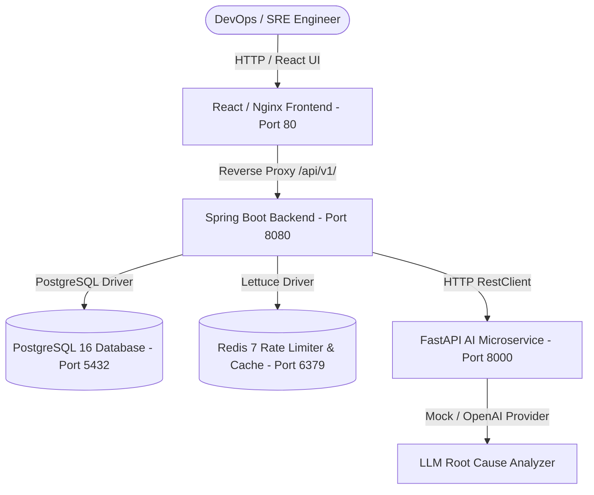

# SentinelOps - AI-Powered DevOps Incident Detection & Root Cause Analysis

**SentinelOps** is an enterprise-grade AI-powered DevOps Incident Detection and Automated Root Cause Analysis (RCA) platform. It ingests multi-service telemetry metrics, error logs, and deployment events to automatically detect statistical anomalies, correlate signals, and deliver actionable AI-generated root cause analyses and automated rollbacks.

---

## System Architecture



---

## Core Capabilities

- **Real-Time Telemetry & Anomaly Engine**: Evaluates CPU, memory, latency, and error rate metrics using statistical Z-Score drift detection against rolling baseline metrics.
- **Automated Root Cause Analysis**: Correlates recent log stack traces (`ERROR`, `WARN`), deployment commits, and telemetry anomalies into comprehensive AI root cause reports.
- **Interactive Operational Dashboard**: Real-Time MTTR (Mean Time to Resolve), service health indices, incident severity breakdowns, and active telemetry charts.
- **Automated Deployment Rollbacks**: One-click and automated deployment rollback correlation for degraded services.
- **Enterprise Security & Audit Logging**: Role-Based Access Control (`ROLE_ADMIN`, `ROLE_DEVELOPER`, `ROLE_VIEWER`), BCrypt password hashing, stateless JWT authentication, and full IP/user audit trails.

---

## Technology Stack

| Component | Technology | Version / Details |
|---|---|---|
| **Backend Service** | Java / Spring Boot | Java 21, Spring Boot 3.3.4, Spring Security, Spring Data JPA |
| **AI Microservice** | Python / FastAPI | Python 3.12+, FastAPI, Pydantic v2, Uvicorn |
| **Frontend UI** | TypeScript / React | React 18, Vite 5, TailwindCSS, Lucide Icons, Recharts, Nginx |
| **Database** | PostgreSQL | PostgreSQL 16 Alpine, Flyway Database Migrations |
| **Caching & Rate Limiting** | Redis | Redis 7 Alpine, Spring Data Redis, Sliding Window Rate Limiter |
| **Containerization** | Docker | Multi-Stage Dockerfiles & Docker Compose V2 Specification |

---

## Environment Variables Reference

| Variable | Description | Default Value |
|---|---|---|
| `SPRING_DATASOURCE_URL` | JDBC PostgreSQL connection URL | `jdbc:postgresql://postgres:5432/sentinelops` |
| `SPRING_DATASOURCE_USERNAME` | PostgreSQL database user | `sentinelops` |
| `SPRING_DATASOURCE_PASSWORD` | PostgreSQL database password | `sentinelops_password` |
| `SPRING_REDIS_HOST` | Redis cache hostname | `redis` |
| `SPRING_REDIS_PORT` | Redis cache port | `6379` |
| `AI_SERVICE_URL` | FastAPI AI microservice URL | `http://ai-service:8000` |
| `JWT_SECRET` | 256-bit HMAC secret for JWT signing | `404E6352...` |
| `LLM_PROVIDER` | AI Service LLM provider (`mock`, `openai`) | `mock` |
| `OPENAI_API_KEY` | OpenAI API key (optional if provider is `openai`) | `""` |

---

## Windows Docker Desktop Deployment Guide

### Prerequisites
To deploy SentinelOps using Docker on Windows, **Docker Desktop** with WSL 2 backend must be installed on your machine.

1. Download and install [Docker Desktop for Windows](https://www.docker.com/products/docker-desktop/).
2. Ensure Docker Desktop is running and WSL 2 integration is enabled.

### Step 1: Start the Dockerized Microservices Stack
Open PowerShell or Command Prompt in the project root directory and run:

```bash
docker compose up -d --build
```
*(This builds the 3 application containers and pulls official PostgreSQL 16 & Redis 7 images).*

### Step 2: Verify Container Health
Check that all 5 containers reach `healthy` status:

```bash
docker compose ps
```

### Step 3: View Real-Time Container Logs
```bash
docker compose logs -f
```

### Step 4: Access Application Endpoints

| Service | Endpoint URL | Description |
|---|---|---|
| **React Frontend** | [http://localhost](http://localhost) | Production Nginx web interface |
| **Spring Boot Backend** | [http://localhost:8080/api/v1](http://localhost:8080/api/v1) | Backend REST API |
| **Swagger UI Docs** | [http://localhost:8080/swagger-ui.html](http://localhost:8080/swagger-ui.html) | OpenAPI 3 Interactive API Explorer |
| **FastAPI AI Service** | [http://localhost:8000/health](http://localhost:8000/health) | AI Service Health Check |

### Step 5: Stop the Application Stack
```bash
docker compose down -v
```

### Troubleshooting Steps
- **Port Conflicts**: Ensure ports `80`, `8080`, `8000`, `5432`, and `6379` are not bound by host processes (e.g. local PostgreSQL or IIS).
- **Service Dependency Waits**: Spring Boot waits for PostgreSQL, Redis, and FastAPI to be healthy before starting. If backend startup stalls, verify `docker compose logs backend`.
- **Database Reset**: To clean database volumes and force Flyway re-seeding, run `docker compose down -v` followed by `docker compose up -d`.

---

## Local Development Setup (Without Docker)

### Step 1: Start FastAPI AI Service
```bash
cd ai-service
pip install -r requirements.txt
python main.py
```
*(Runs on `http://localhost:8000`)*

### Step 2: Start Spring Boot Backend
```bash
cd backend
mvn spring-boot:run
```
*(Runs on `http://localhost:8080`)*

### Step 3: Start React Frontend
```bash
cd frontend
npm install
npm run dev
```
*(Runs on `http://localhost:3000`)*

---

## Completed Verification Checkpoints

- **Backend Unit & Integration Tests**: `27 / 27 PASSED` (`mvn test`)
- **FastAPI AI Service Pytest Suite**: `4 / 4 PASSED` (`pytest`)
- **Frontend TypeScript Safety**: `0 ERRORS` (`npx tsc --noEmit`)
- **Frontend Production Bundle**: `PASSED` (`npm run build`)
- **Live Multi-Service E2E Flow**: `7 / 7 PASSED` (`verify_e2e.py`)

---

## Default Seed User Credentials

| User Role | Email | Password |
|---|---|---|
| **Admin** | `admin@sentinelops.io` | `Password123!` |
| **Developer** | `dev@sentinelops.io` | `Password123!` |
| **Viewer** | `viewer@sentinelops.io` | `Password123!` |

---

## Production Cloud Deployment (Render / Railway / AWS)

SentinelOps is configured with a zero-code-change `render.yaml` infrastructure blueprint for single-click cloud deployment.

### Option A: Render Cloud Deployment (Recommended)
1. Sign in to [Render](https://render.com).
2. Click **New +** -> **Blueprints**.
3. Connect your GitHub repository `https://github.com/sravanigorentla/sentinelops-ai.git`.
4. Render automatically detects `render.yaml` and provisions:
   - Managed PostgreSQL 16
   - Managed Redis 7
   - FastAPI AI Microservice (`https://sentinelops-ai-service.onrender.com`)
   - Spring Boot Backend (`https://sentinelops-backend.onrender.com`)
   - React Frontend (`https://sentinelops-frontend.onrender.com`)

### Option B: Railway Cloud Deployment
1. Sign in to [Railway](https://railway.app).
2. Click **New Project** -> **Deploy from GitHub repo**.
3. Select `sentinelops-ai` repository.
4. Add PostgreSQL and Redis plugins.

### Option C: AWS EC2 / DigitalOcean Cloud VM Deployment
1. Provision an Ubuntu 24.04 LTS instance.
2. Clone repository and run:
   ```bash
   git clone https://github.com/sravanigorentla/sentinelops-ai.git
   cd sentinelops-ai
   docker compose up -d --build
   ```

